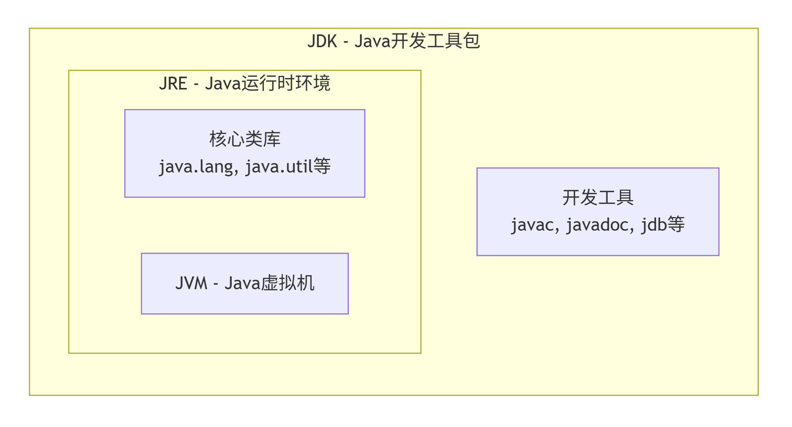
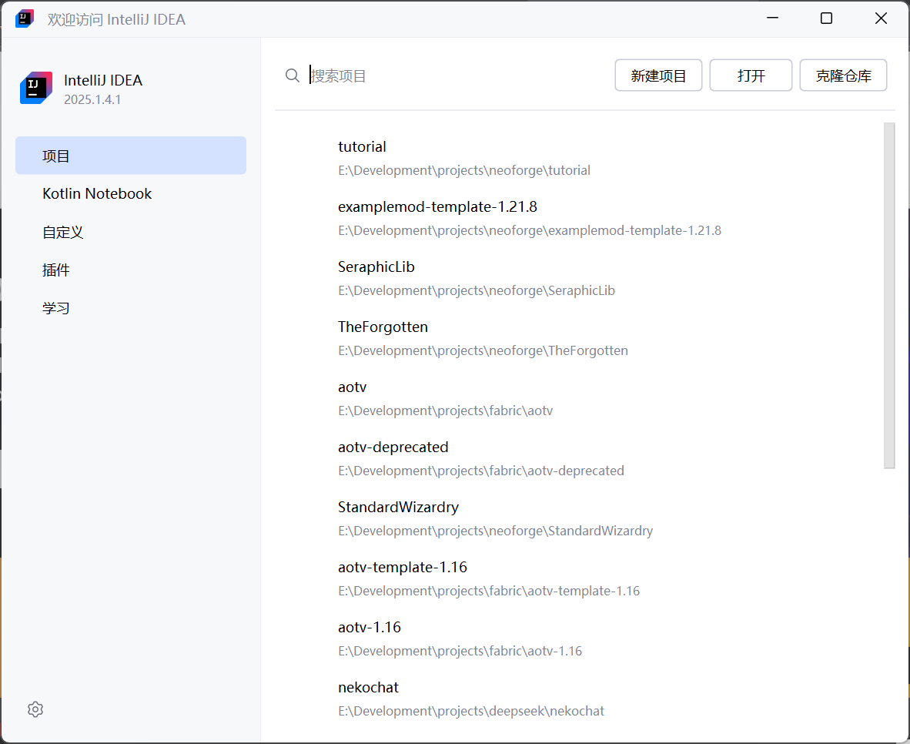
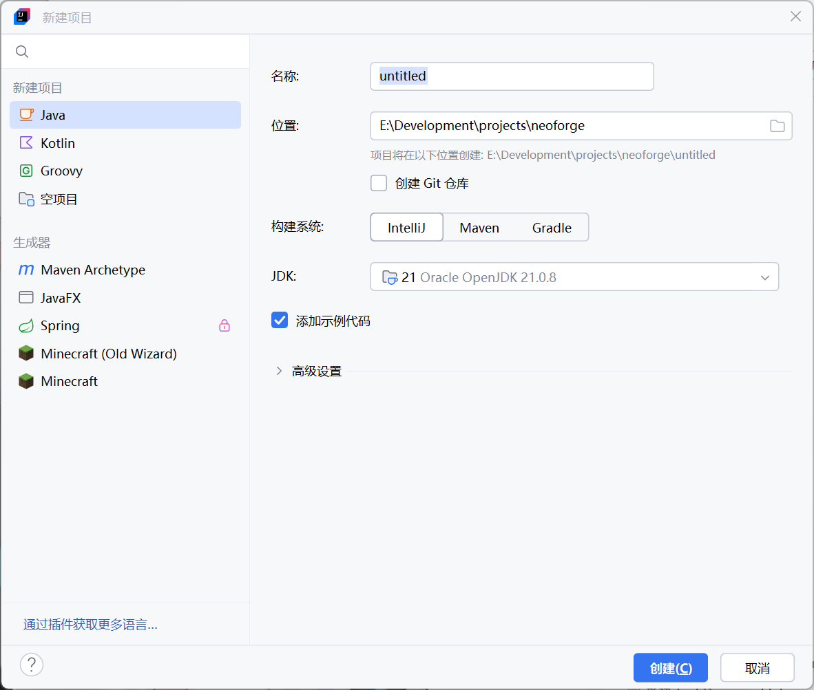
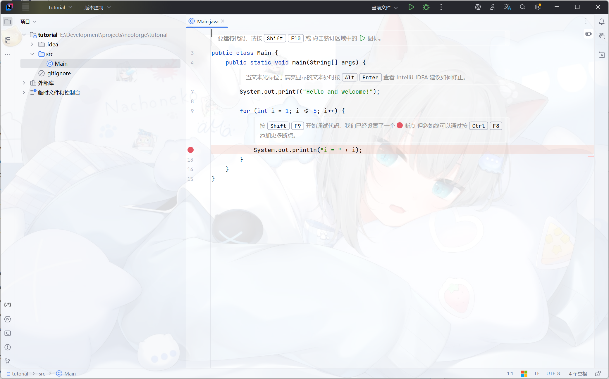
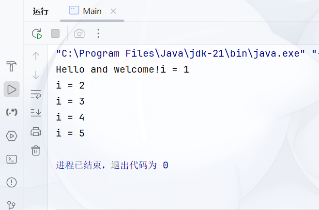

# 第一节 Java初探

学习目标：了解Java的运行方式和特点，搭建开发环境，编写、运行第一个程序  
内容要点：

- Java是什么，以及Java的特点
- Java的文件系统
- JVM、JRE、JDK
- Java的版本系统
- 安装JDK 21、IDE的选择与安装(求求你了别用eclipse了)

## Java是什么?

Java是一款由Sun公司(现属Oracle)发布的高级编程语言。  
Java具有跨平台、面向对象、简单安全等特点。  
由于Java采用虚拟机运行，所以相同的程序只需要使用不同系统的虚拟机，就可以方便地移植到不同的平台

## Java编程中设计的文件类型

制作一个Java程序，需要用到源码文件(.java)、字节码文件(.class)、归档文件(.jar)。

- 源码文件直接以纯文本格式储存~~对就是txt~~，制作程序一般就是直接编辑源码文件。源码文件经过编译生成字节码文件。
- 字节码文件即编译后的代码。字节码中丢弃了源码中不必要的信息，如注释和用户自己的换行习惯等。字节码不可以直接打开，而是要经过反编译才可以以文本格式打开。
- 归档文件直接以压缩包格式储存~~对就是zip~~。归档文件中，除去若干字节码文件，还可以包含这个软件所需的assets以及归档文件的一些信息。

## JVM、JDK、JRE

- JVM即为Java虚拟机。JVM的作用，是将字节码翻译为平台的机器码，是Java跨平台特性的核心支持。
- JRE即Java运行环境。JRE包含JVM，且在JVM的基础上又添加了Java基本库(如系统api、集合api、网络api等)
  。Windows平台上，JRE的核心可运行文件是java.exe。
- JDK即Java开发工具包。JDK包含JRE，且在JRE的基础上添加了一系列用于编译和归档的软件。Windows平台上，JDK提供了javac.exe以供编译，jar.exe以供归档。
  

JDK由不同公司维护，其中我们使用Oracle的OpenJDK。

## Java的版本系统

Java发布分为两种：

- LTS(长期支持版)：企业推荐，支持时间长。
- 非LTS版：每6个月发布，支持期短。

目前已有的LTS包括Java8、Java11、Java17、Java21。其中以Java8和Java21最为常用。
我们这个教程面向Java21进行，如果读者需要用到更早的版本，请自行查询版本差异。
~~对，ojang直到1.16才换掉了Java8~~

## 安装JDK 21、和IDE

ok，[前往Oracle官网下载JDK](https://www.oracle.com/cn/java/technologies/downloads/)  
自己选择适合自己平台的JDK21版本下载安装即可

随后你可以选择一个IDE(集成开发环境)
现在比较常用的包括以下几种：

- [Intellij IDEA](https://www.jetbrains.com/zh-cn/idea/)
- [VSC](https://code.visualstudio.com/)
- [Eclipse](https://www.eclipse.org/)

个人推荐使用IDEA。
安装完成，进入IDEA后，我们看到如下界面：
  
点击右上角新建项目，选择java项目，自己选好名称和位置，其他照着图选
  
随后我们应该进入了IDEA的主界面：
  
这个界面中，左侧是主要的功能性按钮(如文件、运行、调试、构建、git等)。src文件夹就是我们写代码的根目录。  
我们打开Main.java，点击右上角的三角形运行当前文件。
  
然后应该就能看到底下的输出了。

ok，Main.java的使命完成了，你愿意的话可以删掉他了。以后我们不会再用到Main.java了。

以后我提到java文件时，就不再提后缀名了。