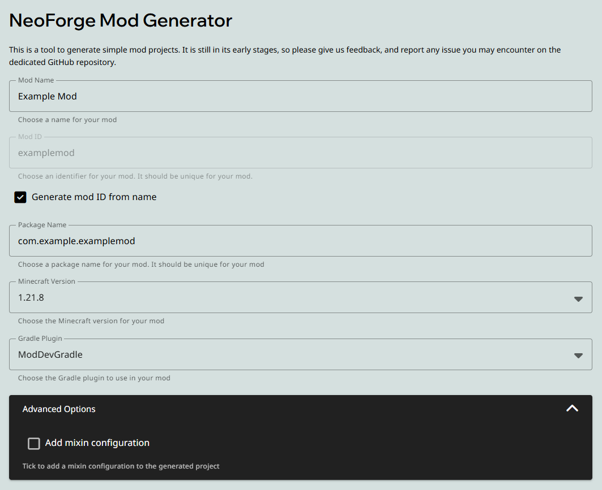

# NeoForge API简介与NeoGradle环境的搭建

- API对于模组开发的作用
    - 三大现代模组加载器及其核心API(Fabric, Forge, NeoForge)
    - 三大模组加载器的特点
- NeoGradle环境搭建
    - Gradle简介

## API

API即**应用程序编程接口**。
API的作用是为不同的软件提供通信平台。利用API时，开发者只需要考虑如何向API发送请求与交换数据，而不需要考虑API内部发生了什么。  
对于Minecraft的模组开发而言，modding API同时需要提供反混淆、注入(Mixin)等一系列操作。Minecraft作为一款商业软件，其源码是不公开的。你下载到的游戏版本中的所有代码都是高度混淆、不可读的。

因此，开发模组第一步是选定一个**反混淆映射表**。反混淆映射表目前主流版本有三个：

- Mojang Mappings：官方映射表，也是当前NeoForge的默认映射表，是目前最完善的映射表
- Yarn：Fabric团队制作的映射表。Yarn更新快，但是质量略逊于Mojang Mappings
- MCP-Reborn：最老牌映射表，也是Forge采用的映射表。现在处于半死不活状态，更新慢、完成度不如官方映射表

---

有了反混淆映射表后，我们还需要一系列注入工具，用于修改Minecraft本身的行为。这个工具就是**SpongeMixin**。  
SpongeMixin的作用是，允许开发者在程序启动之初，通过字节码机制直接修改Minecraft自身的行为。这里不需要太过纠结，Mixin属于很高级的概念了。

基于Mixin，三个团队给出了三个现代模组加载器：
- [NeoForge](https://neoforged.net)：当下代码最成熟、环境最舒适的模组加载器，且得到了官方支持
- [Fabric](https://fabricmc.net/)：超级轻量加载器，极致的性能和注入体验，代价是Fabric本身代码不够健壮，什么功能都要自己写
- [Forge](https://files.minecraftforge.net/net/minecraftforge/forge/)：老牌模组加载器。由于其管理层问题，以及过久的历史带来的过多遗留问题，Forge在1.21开始已经被逐渐淘汰

模组加载器的核心功能包括但不限于：
- 游戏流程控制。三大模组加载器都提供了各自的**事件系统**，允许玩家监听游戏中某些事件(如玩家破坏方块)并作出响应
- 注册表控制。**注册表系统**是Minecraft用于登记方块、物品等游戏内容的核心系统。模组加载器必须对玩家添加的新注册内容进行检查，防止服务端与客户端注册内容出现差异。
- 注入提供。对于更加深入的模组行为，有时候我们不得不采用注入。模组加载器一般都提供了简单的注入接口。
- 网络编程。

1.21以来，Mojang对Minecraft做出了一系列破坏性的更新。也就是说，旧版本的模组必须要大改才能移植到新版本。
~~这不能怪Mojang，他至少把陈年史山改好看了~~。

总之，对于任何开发者，必须注意以下几点：
1. 使用Forge的开发者，尽快适应NeoForge，尽快将所有Forge项目迁移到NeoForge
2. 使用Fabric的开发者，也有必要熟悉NeoForge的开发环境，因为Fabric对Neo的优势也正在逐渐消退
3. 时刻关注Minecraft新版本代码的变化

## NeoGradle环境搭建

Gradle是一个用于管理Java项目的插件。Gradle可以帮你自动下载和管理各种插件和依赖。这里不多展开，有兴趣的读者可以自己阅读Gradle的文档。

安装NeoGradle可以直接前往[NeoForge官网](https://neoforged.net)，找到跳转模组生成器的超链接(自己找，这还要我教吗xie)，并且按照指引完成模组模板的下载。



这个页面上，你可以调整模组名称、mod id、包名、游戏版本、插件版本以及是否添加Mixin配置。

模组名称即游戏中mod列表显示的模组名称，mod id是模组唯一标识符(就是说，有相同modid存在时，游戏会崩溃)，包名就是模组的根软件包。游戏版本我们现在采用的是1.21.8，插件选择NeoGradle。

> NeoGradle和ModDevGradle功能是差不多的，这里用NeoGradle只是方便统一教学。具体差异可以自行查阅[NeoProjects界面](https://projects.neoforged.net/)  
> NeoForge的[教程](https://docs.neoforged.net/)对新手非常友好，我们不再过多讲解NeoForge的知识

随后将压缩包解压到一个你喜欢的目录，用IDEA打开，IDEA会自动识别Gradle项目并构建。

> 如果因为网络问题无法构建，可以使用VPN代理。只需在gradle.properties中添加如下四行即可：
> ```properties
> systemProp.http.proxyHost=127.0.0.1
> systemProp.http.proxyPort=你的VPN端口
> systemProp.https.proxyHost=127.0.0.1
> systemProp.https.proxyPort=你的VPN端口
> ```

随后，等待1h~2h，等待Gradle自动配置就可以了。